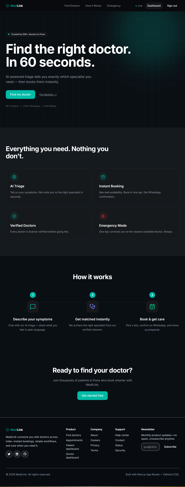

# 🏥 MediLink — Fullstack Doctor Appointment Platform

> Healthcare platform built with Next.js App Router — connecting patients, doctors, and admins in one unified system.

🌐 **Live Demo:** https://medilink-doctors.netlify.app/
📦 **Repository:** https://github.com/Amitpal261/Medilink

---

## ✨ Overview

**MediLink** is a modern fullstack healthcare web application that enables:

* Patients to find doctors & book appointments
* Doctors to manage their profiles
* Admins to manage users and system data

Built using **Next.js App Router**, the project follows a clean modular architecture with server APIs, reusable UI components, and role-based dashboards.

---
## 📸 Preview



---
## 🚀 Core Features


### 🔐 Authentication System

* User registration & login
* Secure session handling
* Role-based access (Admin / Doctor / Patient)

---

### 🩺 Doctor Management

* View doctors list
* Doctor profile creation & update
* Dedicated doctor dashboard

---

### 📅 Appointment System

* Book appointments with doctors
* View & manage appointments
* Dynamic appointment panel UI

---

### 👨‍⚕️ Role-Based Dashboards

* **Admin:** Manage users
* **Doctor:** Manage profile
* **Patient:** View bookings

---

### 🧠 Triage System

* Symptom-based triage flow
* Helps guide users before booking

---

## 🏗️ Project Structure

```bash
app/
 ├── (auth)/           # Login & Register pages
 ├── (dashboard)/      # Role-based dashboards
 │    ├── admin/
 │    ├── doctor/
 │    └── patient/
 ├── api/              # Backend (Next.js API routes)
 │    ├── auth/
 │    ├── doctors/
 │    ├── appointments/
 │    └── users/
 ├── doctors/          # Doctors listing page
 ├── appointments/     # Appointment UI
 └── triage/           # Symptom triage

components/
 ├── ui/               # Reusable UI components
 ├── forms/            # Auth forms
 ├── doctor/           # Doctor components
 └── appointment/      # Appointment components

lib/
 ├── db.ts             # Database connection
 ├── auth.ts           # Auth utilities
 └── validators/       # Zod validation

models/
 ├── User.ts
 ├── Doctor.ts
 └── Appointment.ts
```

---

## 🛠️ Tech Stack

### Frontend + Backend (Fullstack)

* **Next.js 13+ (App Router)**
* **React**
* **TypeScript**

### Styling

* **Tailwind CSS**

### Backend Logic

* **Next.js API Routes**
* **Custom services layer**

### Database

* Likely **MongoDB / SQL (via models)**

---

## ⚙️ Setup Instructions

### 1️⃣ Clone the repository

```bash
git clone https://github.com/Amitpal261/Medilink.git
cd Medilink
```

---

### 2️⃣ Install dependencies

```bash
npm install
```

---

### 3️⃣ Configure Environment Variables

Create a `.env.local` file:

```env
DATABASE_URL=
JWT_SECRET=
NEXT_PUBLIC_BASE_URL=
```

---

### 4️⃣ Run the development server

```bash
npm run dev
```

---

## 🌍 Deployment

* Hosted on **Netlify**
* Uses Next.js SSR/Edge-compatible setup

👉 https://medilink-doctors.netlify.app/

---

## 🧩 Key Concepts Used

* App Router architecture
* Server + Client components
* API route handling
* Custom hooks (`useAuth`, `useAppointments`)
* Role-based UI rendering
* Modular folder structure

---

## 🚧 Future Improvements

* 🔔 Notifications system
* 💳 Payment integration
* 🤖 Advanced AI triage
* 📱 Mobile responsiveness improvements
* 🧑‍⚕️ Doctor availability scheduling

---

## ⚠️ Disclaimer

> This project is for educational/demo purposes.
> Not intended for real medical decision-making.

---

## 👨‍💻 Author

**Amitpal**

GitHub: https://github.com/Amitpal261

---

## 💡 Final Thought

> “Good software doesn’t just solve problems — it creates better systems.”

---
